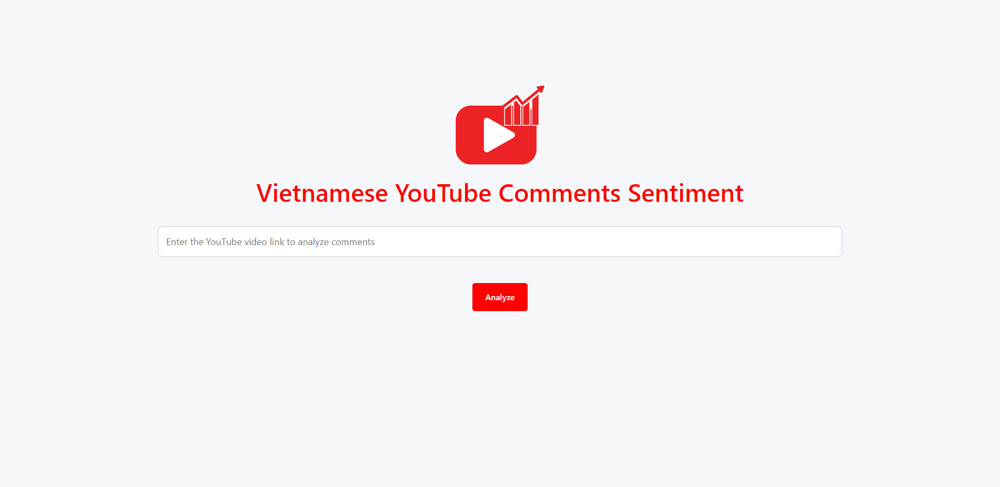
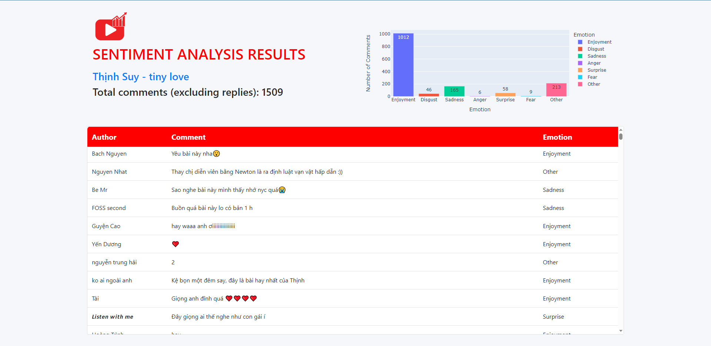

# Vietnamese-Youtube-Comments-Sentiment

Web application classifies and statistics 7 emotional states such as enjoyment, disgust, sadness, anger, surprise, fear and others from Vietnamese comments on YouTube. The model is based on the pre-trained model of [**VinAI Research - PhoBert**](https://github.com/VinAIResearch/PhoBERT)

## Dataset

[UIT-VSMEC](https://paperswithcode.com/paper/emotion-recognition-for-vietnamese-social): The dataset contains **6,927** sentences annotated with 7 emotions [enjoyment, disgust, sadness, anger, surprise, fear and others]. The authors of the article tried to apply several machine learning and deep learning models with UIT-VSMEC. Among the tested models, the Convolutional Neural Network (CNN) model performed the best, achieving a weighted F1-score of **59.74%**.

From the **6,927** sentences divided into 3 files (`train`, `valid`, `test`) in the dataset, I combined the 2 files `train`, `valid` into a set of **6234** sentences then used K-fold cross-validation (K=2) as training data. The remaining **693** sentences in file `test` are used as testing data.

## Model

First, the sentences in the dataset will be standardized according to the utf-8 encoding and preprocessed (delete HTML code, replace common acronym/emoji, delete unnecessary characters). Finally, word segmentation of sentences before training (required for phoBERT).

After training 2-fold, 8 epochs, the model performed best, achieving a weighted F1 score of 65% for the test data and being relatively balanced between classes despite the imbalanced dataset was also like imperfect labeling

## Website

The website is built based on the Flask library, using the Plotly library to draw charts and YouTube Data API v3 to retrieve comments from Youtube.

### How to use

First, copy and paste the YouTube video link to analyze comments into the box below and click `Analyze` button.

After a period of time (depending on the number of comments), the analysis results are given as shown below.

# References

1. [Emotion Recognition for Vietnamese Social Media Text](https://paperswithcode.com/paper/emotion-recognition-for-vietnamese-social)
2. [PhoBERT: Pre-trained language models for Vietnamese](https://github.com/VinAIResearch/PhoBERT)
3. [[PhoBERT] Classification for Vietnamese Text](https://www.kaggle.com/code/trnmtin/phobert-classification-for-vietnamese-text/notebook)
